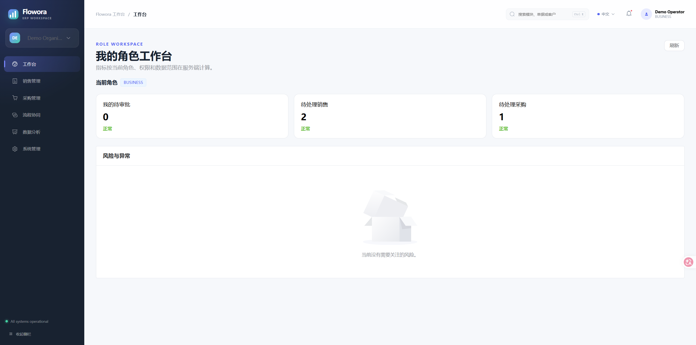
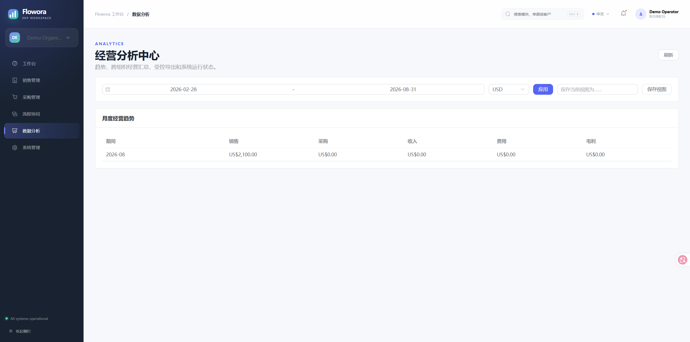
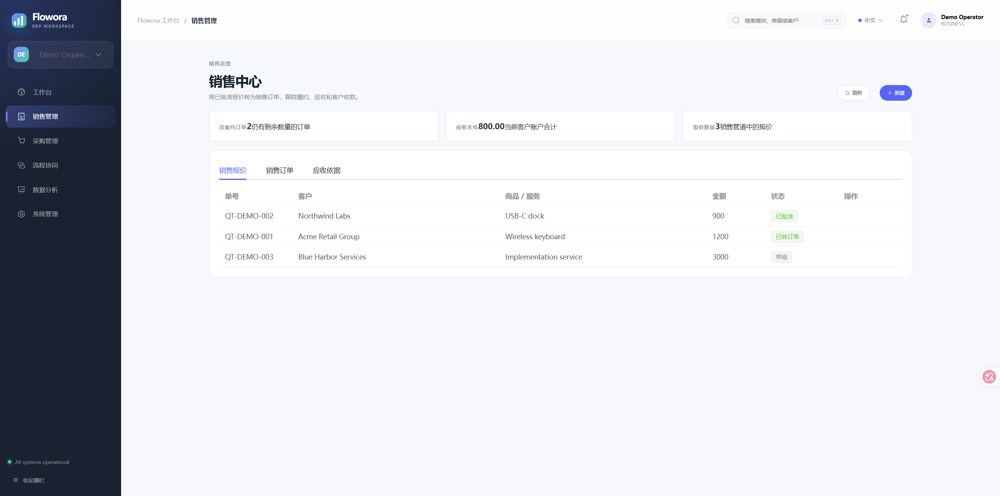
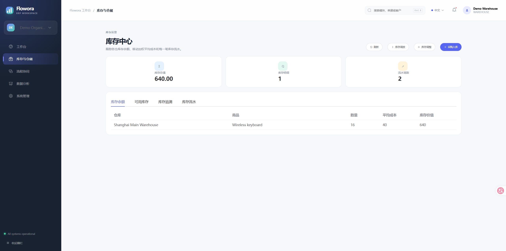
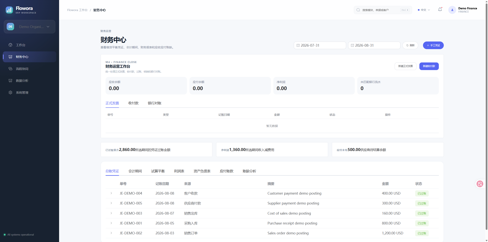
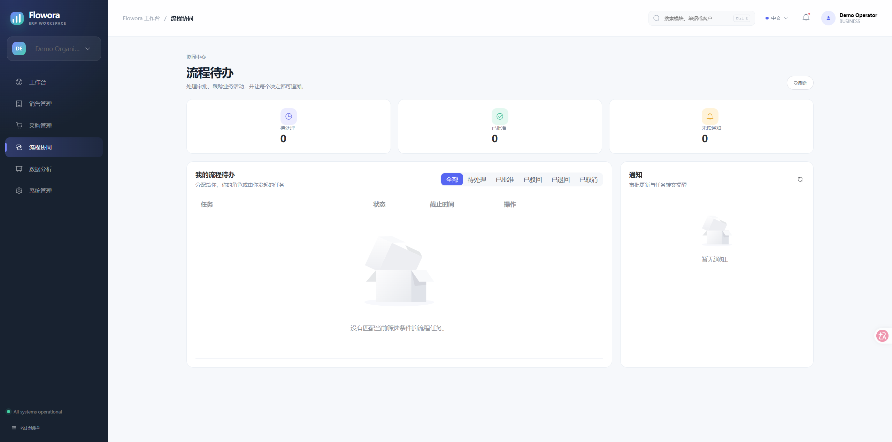
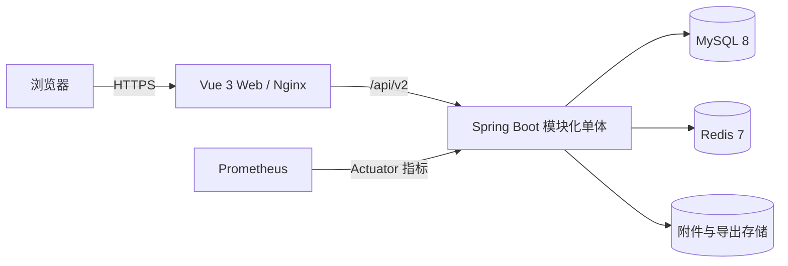

# Flowora ERP 2.0

> 面向贸易、批发与项目服务团队的工作流驱动 ERP，以统一的业务单据、库存、财务、项目和审批协作连接经营全链路。

<p align="center">
  
  
  
  
  
  
</p>

Flowora ERP 采用前后端分离的模块化单体架构，默认中文并支持英文界面。2.0 在 1.0 业务闭环的基础上，完成了多组织身份与权限、复杂贸易和高级库存、正式财务、可配置工作流、项目经营分析以及生产运维能力的系统升级。

> 当前定位：作品展示、产品验证与私有化部署参考。税务、会计及合规规则需在正式商用前结合目标地区和企业制度再次确认。

## 系统预览

| 经营驾驶舱 | 多组织经营分析 |
| --- | --- |
|  |  |

| 销售履约 | 高级库存 |
| --- | --- |
|  |  |

| 财务工作台 | 审批与协作 |
| --- | --- |
|  |  |

截图来自本地隔离演示数据库，不包含生产数据。

## 核心能力

| 领域 | 主要能力 |
| --- | --- |
| 身份与组织 | 持久化账号、密码策略、会话治理、可选 MFA、多组织成员、组织切换与跨组织只读分析 |
| 权限与审计 | 资源/动作级权限、数据范围、职责分离、敏感操作控制、活动流与审计追踪 |
| 主数据 | 客户、供应商、物料、仓库、库位、币种、汇率、税率、科目及组织配置 |
| 销售与采购 | 多行单据、报价/订单/交付/收款、请购/采购/收货/付款、来源追溯、部分履约、退货与冲销 |
| 高级库存 | 仓库与库位、批次/序列号/效期、预留、冻结、调拨、盘点、调整与库存流水 |
| 财务 | 应收应付、发票与贷项单、收付款、三单匹配、银行账户、预算、外币、会计期间、凭证与总账 |
| 工作流与协作 | 模板和版本、条件路由、并行审批、转交/委托、SLA、评论、附件、@ 提及与通知 outbox |
| 项目经营 | 项目、任务、里程碑、工时、费用、预算、开票与项目收入/成本/毛利分析 |
| 分析与导出 | 经营看板、跨组织聚合、保存视图、权限治理导出、异步任务与运行诊断 |
| 兼容与升级 | v1 读取兼容、v2 统一写入、Flyway V1–V19、升级预检、控制总数、备份恢复 |

## 系统架构



Web 端只通过同源 `/api` 访问后端。生产部署中 MySQL、Redis、API 管理端口和 Prometheus 均不直接暴露到公网。

## 技术栈

| 层级 | 技术 |
| --- | --- |
| Web | Vue 3、TypeScript、Vite、Element Plus、Pinia、Vue Router、vue-i18n、Axios |
| API | Java 25、Spring Boot 4.0.8、Spring Security、Spring Data JPA/JDBC、Flyway、Actuator |
| 数据 | MySQL 8、Redis 7 |
| 可观测性 | Micrometer、Prometheus、健康检查、诊断包、业务运行指标 |
| 契约与质量 | OpenAPI、ESLint、vue-tsc、Vitest、JUnit、GitHub Actions |
| 工程化 | pnpm Workspace、Maven Wrapper 3.9.16、Docker Compose |

## 仓库结构

```text
Flowora-ERP/
├─ apps/web/                 Vue 3 前端应用
├─ services/api/             Spring Boot API 与 Flyway 迁移
├─ deploy/prometheus/        Prometheus 配置和告警规则
├─ docs/                     产品、架构、开发、发布与运维文档
├─ tools/operations/         备份与恢复工具
├─ tools/upgrade/            1.0 → 2.0 升级与核对工具
├─ .github/                  CI、Issue 和 PR 模板
├─ compose.yaml              生产拓扑参考
└─ package.json              Monorepo 统一命令入口
```

## 快速开始

### 环境要求

- Node.js 24+、pnpm 11+
- Java 25（Maven Wrapper 3.9.16 已包含）
- MySQL 8+、Redis 7+

### 1. 安装

```powershell
git clone https://github.com/Marsh-Yan/Flowora-ERP.git
cd Flowora-ERP
pnpm install
```

### 2. 配置数据库与 Redis

启动 MySQL 和 Redis，创建 `flowora_erp` 数据库，再按本机环境设置：

```powershell
$env:DB_URL = "jdbc:mysql://localhost:3306/flowora_erp?useUnicode=true&characterEncoding=utf8&serverTimezone=UTC"
$env:DB_USERNAME = "flowora"
$env:DB_PASSWORD = "replace-with-local-password"
$env:REDIS_HOST = "localhost"
$env:REDIS_PORT = "6379"
$env:REDIS_PASSWORD = "replace-with-local-password"
$env:FLOWORA_MFA_ENCRYPTION_KEY = "replace-with-at-least-32-random-characters"
```

不要把真实密码或密钥提交到仓库。API 启动时会由 Flyway 自动执行尚未应用的迁移。目标容器部署使用 `production` profile；`compose.yaml` 要求非空的 `DB_PASSWORD`、`DB_ROOT_PASSWORD`、`REDIS_PASSWORD` 和 `FLOWORA_MFA_ENCRYPTION_KEY`。

### 3. 启动 API

```powershell
.\mvnw.cmd -pl services/api -am spring-boot:run -Dspring-boot.run.profiles=local
```

API 默认地址为 `http://localhost:8080`。不指定 `local` profile 时使用 `standalone`，只提供健康检查和版本接口，不连接业务数据库或提供业务接口。

### 4. 启动 Web

```powershell
pnpm dev:web
```

访问 Vite 输出的本地地址（通常为 `http://localhost:5173`）。前端默认通过 `/api` 调用后端；环境变量参考 [`apps/web/.env.example`](apps/web/.env.example)。

### 演示账号

本地演示账号统一密码为 `Demo123!`：

| 账号 | 角色 |
| --- | --- |
| `admin@demo.flowora` | 管理员 |
| `operator@demo.flowora` | 业务人员 |
| `warehouse@demo.flowora` | 仓库人员 |
| `finance@demo.flowora` | 财务人员 |
| `project@demo.flowora` | 项目经理 |
| `manager@demo.flowora` | 管理层 |

演示账号禁止复用于生产。详见[演示账号文档](docs/development/demo-accounts.md)。

## Docker Compose 部署

```powershell
Copy-Item .env.example .env
# 编辑 .env，替换全部示例密码、MFA 密钥和允许来源
docker compose build
docker compose up -d
docker compose ps
```

Web 默认发布到 `http://localhost:8080`。`.env` 不得提交；正式上线前还需配置 HTTPS、外部备份、共享附件/导出存储、日志采集和告警。详见[生产部署指南](docs/deployment/production.md)。

## API 与版本策略

- [v2 OpenAPI 契约](docs/api/openapi-v2.yaml)；[v1 契约](docs/api/openapi.yaml)。
- 2.0 所有新业务写入统一使用 `/api/v2`。
- v1 保留读取与认证兼容；v1 业务写入返回 HTTP `426 Upgrade Required`。
- 关键写入支持幂等保护，响应包含请求标识，便于问题追踪与安全重试。

## 数据库升级

数据库迁移覆盖 Flyway `V1` 至 `V19`。V17/V18 的库存切换和数量核对见[库存切换规则](docs/development/inventory-cutover.md)，V19 财务设置补缺及应用 UTC 会话配置见[组织财务与时间](docs/development/organization-finance-time.md)。从 1.0 升级必须在维护窗口内按“预检 → 备份 → 迁移 → 控制总数核对 → 业务冒烟”执行：

```powershell
tools\upgrade\flowora-upgrade.ps1 -Stage Prepare
tools\upgrade\flowora-upgrade.ps1 -Stage Migrate -ConfirmMigration
```

请勿对生产库跳过预检或备份。详见[1.0 → 2.0 升级手册](docs/upgrades/1.0-to-2.0.md)与[备份恢复手册](docs/operations/backup-restore.md)。

## 质量检查

```powershell
pnpm verify:web       # 规范、类型、单测和生产构建
pnpm test:api         # API 单元与集成测试
pnpm verify:release   # 本地质量检查；完整发布门禁见验证文档
```

对 `main` 的推送和 Pull Request 会触发 GitHub Actions，执行 Web、API、隔离 MySQL/Redis 事务与 HTTP、目标 Compose 和 Windows Wrapper 检查。入口见[发布验证](docs/development/release-verification.md)，实际覆盖与剩余发布门禁见[验收记录](docs/development/audit-verification.md)。CI 通过仍需补齐浏览器全业务分支、升级恢复及部署验收。

## 安全与运维基线

- 生产环境使用 Secure、HttpOnly、SameSite 会话 Cookie，并开启 CSRF、CSP、防嵌入与来源控制。
- 数据库应用账号最小权限运行；MFA、数据库和 Redis 密钥分别生成并由部署平台注入。
- 演示数据在生产环境关闭；诊断包只收集白名单配置和健康状态。
- 提供存活/就绪检查、Prometheus 指标、工作流 SLA、outbox 失败和连接池监控。
- 升级前备份数据库与附件并校验 SHA-256；恢复必须先在隔离目标完成演练。

## 项目状态

Flowora ERP 2.0 的 M1–M5 已完成：

1. M1：身份、组织、权限与 1.0 兼容基线
2. M2：主数据、销售采购与高级库存
3. M3：财务、工作流、项目与跨模块协作
4. M4：分析、导出、可观测性与质量加固
5. M5：生产部署、备份恢复、升级演练与发布收口

各阶段变更和验收证据见 [`docs/releases/`](docs/releases/)；产品范围和门禁见[2.0 PRD](docs/product/prd-2.0.md)与[2.0 阶段目标](docs/development/stage-gates-2.0.md)。

## 文档导航

| 文档 | 用途 |
| --- | --- |
| [2.0 产品需求文档](docs/product/prd-2.0.md) | 产品目标、角色、范围、规则和验收标准 |
| [2.0 开发实施规划](docs/development/development-plan-2.0.md) | 技术路线、依赖、阶段拆分与交付要求 |
| [架构 ADR](docs/architecture/adr-0001-stack.md) | 技术选型与架构约束 |
| [2.0 演进策略](docs/architecture/adr-0002-version-2-evolution.md) | 版本、数据和兼容策略 |
| [开发工作流](docs/development/workflow-v2.md) | 分支、提交、测试与审核约定 |
| [安全规范](docs/development/security.md) | 身份、权限、密钥和安全测试要求 |
| [生产部署](docs/deployment/production.md) | 容器拓扑、上线检查与扩缩容 |
| [备份与恢复](docs/operations/backup-restore.md) | 数据和文件备份、校验及恢复演练 |
| [M5 发布说明](docs/releases/2.0.0-m5.md) | 2.0 最终阶段范围与发布证据 |

## 参与贡献

1. 从 `main` 创建短生命周期分支。
2. 保持提交聚焦，并同步更新文档和 OpenAPI 契约。
3. 提交前执行 `pnpm verify:release`；涉及数据库时补充迁移与回滚验证。
4. 按 PR 模板提供变更范围、测试证据和风险说明，通过 CI 与人工审核后合并。

提交问题时请勿附带真实客户数据、账号、密钥或数据库备份。

## License

本项目当前用于作品展示与产品验证，尚未附带开源许可证。除非仓库后续明确增加许可证，否则默认不授予复制、修改、分发或商业使用权。
