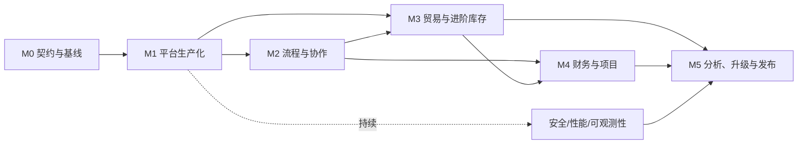

# MyERP 2.0 详细开发实施规划

> 本文承接《MyERP 2.0 产品需求文档》，用于立项估算、团队排期、任务创建、联调测试与发布决策。本文只规划研发工作，不包含代码实现，也不改变 PRD 已确定的业务规则。

## 1. 文档信息

| 项目 | 内容 |
| --- | --- |
| 文档版本 | 1.0 |
| 文档状态 | 待评审，可用于立项和工作包拆分 |
| 编制日期 | 2026-08-28 |
| 上游文档 | `docs/product/prd-2.0.md` |
| 适用版本 | MyERP 2.0 |
| 计划层级 | 里程碑 → 工作包（WP）→ Story → Task |
| 研发周期 | 36–45 周，另预留 4–8 周试点与稳定期 |

### 1.1 文档目标

1. 将 PRD 的 127 条需求转换为可估算、可分配、可测试、可追踪的研发工作；
2. 明确平台、业务、财务、迁移、运维之间的依赖和集成顺序；
3. 为每个里程碑定义交付物、出口条件和不可遗留的阻断项；
4. 保证 1.0 升级过程可预检、可演练、可核对、可回滚；
5. 把安全、性能、监控、备份和恢复纳入持续开发，而不是上线前补做。

### 1.2 使用对象

- 产品负责人：确认范围、优先级和验收口径；
- 技术负责人：确认架构、契约、依赖和工程门禁；
- 前后端研发：据此创建 Story、接口、页面和数据任务；
- QA：建立测试矩阵、自动化范围和发布门禁；
- 运维/实施：准备环境、迁移、监控、备份和切换；
- 项目负责人：配置人员、安排 Sprint、管理风险和 Go/No-Go。

### 1.3 范围与非目标

本文覆盖需求澄清、技术设计任务、研发任务、测试、迁移、发布和稳定期；不替代详细设计、OpenAPI、ERD、测试用例和运行手册。本文不修改业务代码、数据库或部署环境，也不承诺具体自然日期。

## 2. 实施原则与架构护栏

### 2.1 核心原则

1. **契约先行**：状态机、API、权限、金额、日期和记账契约先冻结，再实现页面与服务；
2. **纵向闭环**：每个工作包覆盖后端、前端、数据、权限、审计和测试，不以接口完成代表业务完成；
3. **职责分离**：生命周期与审批状态独立，交易域不直接写总账，普通 CRUD 不直接改库存；
4. **可追溯**：影响库存、余额或利润的动作必须追到来源单据、操作者和事件；
5. **可重复升级**：迁移过程幂等，支持多次演练，并输出控制总数和异常清单；
6. **默认安全**：最小权限、组织隔离、敏感字段保护、审计和依赖扫描进入基础工程；
7. **可运营交付**：健康检查、监控、告警、备份、恢复演练和运行手册属于发布必需品；
8. **不伪造完整性**：M3 只交付财务来源事件，正式发票、凭证和余额在 M4 完成后才宣告闭环。

### 2.2 模块职责

| 领域 | 核心职责 | 约束 |
| --- | --- | --- |
| Identity | 登录、会话、MFA、密码策略 | 不决定业务数据范围 |
| Organization | 法人/组织/部门和成员归属 | 不直接实现角色权限 |
| Authorization | 角色、权限、数据范围判定 | 服务端必须强制执行 |
| Master Data | 客户、供应商、商品、税率、币种 | 不沉淀交易余额 |
| Workflow | 模板、实例、任务、委托和 SLA | 不绕过业务状态机 |
| Collaboration | 动态、评论、附件和通知 | 不作为正式审计账本 |
| Sales/Procurement | 商务单据、履约和退货 | 不直接写总账余额 |
| Inventory | 库位、追踪、预留、移动和盘点 | 数量只能由库存事件产生 |
| Finance | 发票、凭证、期间、核销、银行和报表 | 已记账记录通过冲销纠正 |
| Project | 项目执行、计费和盈利分析 | 复用客户和财务主数据 |
| Analytics | 查询、聚合、工作台和导出 | 必须继承权限和组织范围 |
| Platform/Ops | 配置、任务、日志、监控、备份和部署 | 不承载业务决策 |

### 2.3 数据与接口护栏

- 已发布迁移 V1–V9 冻结，2.0 数据库变更从 V10 起顺序追加；
- 所有业务表明确组织键、审计字段、软删除/归档和并发策略；
- 金额采用定点数，并保存币种、原币、本位币、汇率及汇率来源；
- businessDate、accountingDate、exchangeRateDate、dueDate、postedAt 分别建模；
- API v2 统一错误体、分页、过滤、排序、幂等键、版本冲突和追踪 ID；
- v1 仅保留认证、会话与无损查询，业务写统一拒绝并返回 HTTP 426；
- 跨模块副作用采用事务事件或 Outbox，消费者必须幂等、可重试、可补偿；
- 查询与导出必须经过相同的组织、角色和数据范围校验。

### 2.4 Web 端护栏

- 统一应用壳、路由守卫、组织上下文、权限组件和异常处理；
- 优先建设表格、表单、状态标签、审批面板、附件区和活动流共享组件；
- 页面覆盖加载、空态、失败、无权限、并发冲突和只读状态；
- 关键动作提供确认、幂等保护、结果反馈和可追踪业务编号；
- 桌面端为主，核心查询和审批在窄屏可用，并达到 PRD 的无障碍基线。

## 3. 团队、节奏与估算

### 3.1 建议核心团队

| 角色 | 建议投入 | 主要职责 |
| --- | ---: | --- |
| 产品负责人/业务分析 | 1–2 | 澄清、验收、变更控制 |
| 技术负责人 | 1 | 架构、契约、评审和关键风险 |
| 后端研发 | 3–4 | 平台、交易、库存、财务和迁移 |
| 前端研发 | 2–3 | 设计系统、工作台和业务页面 |
| QA/测试开发 | 2 | 自动化、验收和非功能测试 |
| DevOps/SRE | 0.5–1 | CI/CD、监控、备份和发布 |
| DBA/数据支持 | 0.5 | 模型、迁移、性能和核对 |
| 财务领域顾问 | 0.2–0.5 | 记账、期间、报表和月结验收 |

若后端少于 3 人或无专职 QA，应降低并行度并延长 M3、M4。财务里程碑必须由懂会计业务的人员参与评审和验收。

### 3.2 研发节奏

- 两周一个 Sprint；每个里程碑前安排 3–5 天设计与计划窗口；
- 每周一次跨域集成评审，每个 Sprint 至少一次产品验收和缺陷分级；
- 工作包控制在 1–3 个 Sprint，超过 3 个 Sprint 必须再次拆分；
- 每个里程碑结束形成可部署版本、测试报告、风险清单和变更记录；
- 工程量以人周表示，含设计、实现、评审、自测及普通缺陷修复；
- 项目管理、等待、环境和跨团队依赖另预留 15%–25% 缓冲。

## 4. 总体依赖与里程碑

| 里程碑 | 核心结果 | 自然周期 | 后端人周 | 前端人周 | QA 人周 | Ops/数据人周 |
| --- | --- | ---: | ---: | ---: | ---: | ---: |
| M0 | 需求与技术契约可执行 | 2–3 周 | 2–3 | 1–2 | 1–2 | 1 |
| M1 | 身份、组织、权限、主数据生产化 | 6–7 周 | 12–15 | 6–8 | 5–7 | 2–3 |
| M2 | 通用审批与协作闭环 | 6–7 周 | 11–14 | 8–11 | 5–7 | 2–3 |
| M3 | 销售、采购、进阶库存闭环 | 8–10 周 | 18–24 | 14–18 | 9–12 | 2–3 |
| M4 | 财务、银行、预算、项目闭环 | 8–10 周 | 18–24 | 12–16 | 9–12 | 2–3 |
| M5 | 分析、升级、加固、试点和发布 | 6–8 周 | 8–12 | 8–10 | 10–14 | 8–12 |
| 稳定期 | 试点观察与分批推广 | 4–8 周 | 按缺陷 | 按缺陷 | 4–8 | 4–8 |

总量约为后端 69–92 人周、前端 49–65 人周、QA 39–54 人周、运维/数据 19–30 人周，不含产品、管理和重大范围变化。

## 5. M0：需求与技术契约

### 5.1 工作包

| ID | 工作包 | 交付物 | 前置 | 估算 |
| --- | --- | --- | --- | ---: |
| WP-00-01 | 需求追踪与边界冻结 | 127 条追踪表、P0/P1、非目标 | PRD | 2–3 人日 |
| WP-00-02 | 领域与状态机契约 | 聚合边界、状态图、命令与不变量 | 00-01 | 4–6 人日 |
| WP-00-03 | API v2 契约 | OpenAPI 基线、错误、分页、幂等、并发 | 00-02 | 4–6 人日 |
| WP-00-04 | 数据与迁移基线 | ERD、V10+、索引、组织键、归档规则 | 00-02 | 4–6 人日 |
| WP-00-05 | 权限与审计矩阵 | 角色、动作、范围、敏感动作、审计事件 | 00-01 | 3–5 人日 |
| WP-00-06 | 金额、日期、汇率与记账契约 | 舍入、税、日期语义和分录草案 | 00-02 | 4–6 人日 |
| WP-00-07 | 升级盘点 | 字段映射、脏数据规则、控制总数、样本 | 00-04 | 4–6 人日 |
| WP-00-08 | 质量与发布基线 | 测试门禁、SLO、RTO/RPO、验收模板 | 全部 | 3–5 人日 |

### 5.2 M0 出口条件

- P0 需求均有责任域、验收标准和目标里程碑；
- 状态机、权限矩阵、API 通则、数据模型和升级策略完成评审；
- 准备至少一份脱敏 1.0 数据快照与控制总数；
- 财务顾问确认金额、日期、税、汇率和记账契约；
- 未决问题均有负责人、截止时间和默认决策，无无主阻断项。

## 6. M1：生产化平台

### 6.1 工作包

| ID | 工作包 | PRD 范围 | 前置 | 估算 |
| --- | --- | --- | --- | ---: |
| WP-10-01 | 身份模型与登录安全 | IAM-001～004 | M0 | 1.5–2 人周 |
| WP-10-02 | 会话、MFA 与安全控制 | IAM-005～009 | 10-01 | 1.5–2 人周 |
| WP-10-03 | 组织树与成员归属 | ORG-001～004 | M0 | 1.5–2 人周 |
| WP-10-04 | 组织上下文与隔离 | ORG-005～006 | 10-03 | 1–1.5 人周 |
| WP-10-05 | 角色、权限与数据范围 | ACL-001～005 | 10-03 | 2–2.5 人周 |
| WP-10-06 | 权限管理、缓存与审计 | ACL-006～008 | 10-05 | 1.5–2 人周 |
| WP-10-07 | 主数据通用框架 | MST-001、008～010 | 10-04/05 | 2–2.5 人周 |
| WP-10-08 | 伙伴与商品主数据 | MST-002～007 | 10-07 | 2–3 人周 |
| WP-10-09 | Web 应用壳与共享组件 | M1 页面 | API 基线 | 2.5–3.5 人周 |
| WP-10-10 | 平台集成与安全测试 | M1 全量 | 10-01～09 | 1.5–2 人周 |

### 6.2 任务拆分

后端与数据：

- 用户、凭据、会话、MFA 因子、恢复码和安全事件模型；
- 密码散列升级、暴力限制、会话撤销和敏感操作再认证；
- 组织树、成员归属、默认组织与组织切换上下文；
- 权限点、角色、用户授权、数据范围和服务端强制过滤；
- 权限缓存失效机制及授权生效时限；
- 客户、供应商、商品、单位、税率、币种等主数据；
- 重复检测、编码唯一性、启停用、导入校验和引用保护；
- 审计行为、对象、前后值、组织、IP 与追踪 ID；
- 唯一约束、外键、索引及组织隔离回归数据集。

前端：

- 登录、MFA、密码修改、会话管理和账户安全；
- 组织切换、组织树、成员、角色和权限配置；
- 动态导航、路由守卫、按钮权限和无权限反馈；
- 主数据列表、详情、编辑、启停用和导入结果；
- 共享表格、筛选、分页、表单、金额、日期、状态和错误组件。

测试：

- 登录绕过、暴力尝试、MFA 恢复、会话撤销；
- 角色组合、数据范围交集、跨组织 ID 猜测和缓存失效；
- 主数据重复、禁用后引用、导入和并发编辑；
- 所有受保护 API 的无权限/同组织/跨组织/管理员四象限。

### 6.3 M1 出口条件

- IAM、ORG、ACL、MST 的 P0 验收通过；
- 跨组织越权自动化测试全量通过，授权不依赖前端隐藏；
- 后续模块可直接复用组织、权限、审计和主数据服务；
- 基础监控可定位登录失败、API 错误、慢请求和任务失败；
- 无阻断 M2/M3 的 P0 缺陷。

## 7. M2：流程与协作

### 7.1 工作包

| ID | 工作包 | PRD 范围 | 前置 | 估算 |
| --- | --- | --- | --- | ---: |
| WP-20-01 | 审批模板与版本模型 | WFL-001～003 | M0/M1 | 1.5–2 人周 |
| WP-20-02 | 审批实例、节点与状态机 | WFL-004～007、010 | 20-01 | 2–2.5 人周 |
| WP-20-03 | 审批人解析、委托与 SLA | WFL-004、008～009 | 20-02 | 1.5–2 人周 |
| WP-20-04 | 待办中心与流程设计器 | WFL-001～011 | 20-01～03 | 2.5–3.5 人周 |
| WP-20-05 | 活动流、评论与 @ 提及 | COL-001～002、006 | M1 | 1.5–2 人周 |
| WP-20-06 | 附件与对象存储 | COL-003～005 | M1 | 1.5–2 人周 |
| WP-20-07 | Outbox、邮件与重试 | COL-007～008 | 20-05/06 | 1.5–2 人周 |
| WP-20-08 | 业务接入 SDK 与集成测试 | WFL/COL 全量 | 20-01～07 | 1.5–2 人周 |

### 7.2 后端与数据任务

- 建立流程模板、版本、节点、条件、动作、适用组织与启停用模型；
- 模板发布后不可原位改变历史语义，新配置通过版本切换生效；
- 建立流程实例、审批任务、操作记录、意见、超时和终止状态；
- 支持同意、拒绝、退回、撤回、取消以及业务单据状态回调；
- 审批人解析覆盖指定用户、角色、组织负责人、发起人上级和表达式；
- 委托需校验有效期、组织范围、冲突和循环委托；
- SLA 计算、催办、升级和后台扫描任务必须幂等；
- 活动流记录业务事件摘要；评论、提及与附件保留独立权限；
- 附件保存元数据、哈希、大小、MIME、对象键和引用关系；
- 对象存储使用受控上传/下载，执行大小、类型、恶意文件和孤儿清理策略；
- Outbox 事务落库，通知消费者支持重试、死信、手工重放和去重；
- 形成供销售、采购、财务、项目统一调用的接入契约。

### 7.3 前端任务

- 流程模板列表、版本管理、可视化节点/条件配置和发布校验；
- 我的待办、我发起的、已处理、抄送与超时筛选；
- 单据内审批轨迹、当前节点、意见输入、退回与撤回交互；
- 通用活动流、评论、提及、附件上传/预览/下载组件；
- 通知中心、已读状态、失败提示和外部邮件偏好配置。

### 7.4 测试重点

- 并行/串行审批、条件边界、拒绝、退回、撤回和模板版本隔离；
- 无审批人、审批人离职、循环委托、过期委托和 SLA 跨时区；
- 重复回调、重复消费、服务重启和死信重放；
- 越权读取评论/附件、伪造 MIME、超限文件及失效下载链接；
- 业务单据与审批状态在并发操作下保持一致。

### 7.5 M2 出口条件

- 至少以两个不同业务对象完成流程接入验证；
- 历史实例不受模板新版本影响，审批操作全程可审计；
- Outbox 重试和死信重放演练成功，不产生重复副作用；
- 附件权限与业务对象权限一致，恶意/超限上传被阻断；
- M3、M4 可通过统一契约接入审批、动态和通知。

## 8. M3：贸易与进阶库存

### 8.1 工作包

| ID | 工作包 | PRD 范围 | 前置 | 估算 |
| --- | --- | --- | --- | ---: |
| WP-30-01 | 通用交易单据框架 | SAL/PRC 公共能力 | M1/M2 | 2–2.5 人周 |
| WP-30-02 | 仓库、库位和追踪主数据 | MST-002～005、INV-001～004 | M1 | 2–2.5 人周 |
| WP-30-03 | 价格、供应、信用与补货规则 | MST-006～007、SAL/PRC 规则 | M1 | 2–2.5 人周 |
| WP-30-04 | 库存账、批次/序列号与余额 | INV-001～004 | 30-02 | 2.5–3 人周 |
| WP-30-05 | 预留、分配和缺货处理 | INV-005、009 | 30-04 | 2–2.5 人周 |
| WP-30-06 | 收货、拣货、调拨和盘点 | INV-006～009、013 | 30-04/05 | 3–4 人周 |
| WP-30-07 | 报价、销售订单与交付 | SAL-001～009 | 30-01/05 | 3–4 人周 |
| WP-30-08 | 销售退货与质量处置 | SAL-010～013、INV-010～012 | 30-07 | 2–3 人周 |
| WP-30-09 | 采购申请、订单与收货 | PRC-001～007 | 30-01/06 | 3–4 人周 |
| WP-30-10 | 采购退货与来源链 | PRC-008～010 | 30-09 | 2–2.5 人周 |
| WP-30-11 | 贸易与仓储工作台 | SAL/PRC/INV 页面 | 30-01～10 | 3–4 人周 |
| WP-30-12 | 并发、追溯与端到端测试 | M3 全量 | 30-01～11 | 2.5–3.5 人周 |

### 8.2 通用交易与计算任务

- 统一单据头、行、地址、联系人、币种、税、折扣、备注和附件结构；
- 冻结逐行/汇总舍入、含税/未税、价格精度和汇率快照；
- 保存来源行链接，支持一对多拆分、部分履约、退货和剩余数量；
- 状态动作由领域命令执行，并校验审批状态、组织、权限和版本号；
- 所有创建、确认、收货、发货、取消和退货命令支持幂等键；
- 信用检查、库存检查、供应商资格和审批规则返回结构化阻断原因。

### 8.3 库存任务

- 仓库、库位层级、收货/暂存/拣货/退货/不良品等用途；
- 商品追踪策略在业务发生后受限变更，批次和序列号唯一性可配置；
- 库存事件、移动、余额、成本来源和业务来源形成不可丢失的链路；
- 现存、预留、可用、在途分开计算，任何动作不得造成负库存；
- 预留支持订单触发、手工调整、部分分配、释放和过期处理；
- 收货、上架、拣货、发货、调拨采用受控状态机；
- 盘点支持范围冻结、账面快照、差异审批和差异过账；
- 退货区分可售、待检、不良、报废及退回供应商处置；
- 为并发拣货、重复提交和同一序列号多次使用建立数据库与应用双重保护。

### 8.4 销售与采购任务

- 报价版本、有效期、转订单、销售审批、信用检查、库存承诺和交付；
- 部分发货、取消剩余、销售退货、退款/贷项来源事件；
- 采购申请、供应商选择、采购审批、订单、部分收货和关闭；
- 超收/少收容差、检验/拒收、采购退货和供应商对账来源；
- 销售、采购在 M3 只形成应开票/应收退款/应付调整来源，不直接生成伪凭证；
- M4 接入前保留明确的“待财务处理”状态与可核对事件队列。

### 8.5 前端任务

- 报价、销售订单、出库/交付、退货及状态时间线；
- 采购申请、订单、收货、退货及来源关联；
- 仓库库存、批次/序列号追溯、预留分配、调拨和盘点；
- 信用、缺货、审批、并发冲突及财务待处理的明确反馈；
- 条码/快速录入能力若设备未定，先用键盘友好的标准输入完成 P0。

### 8.6 测试重点

- 多币种、多税率、折扣、舍入、部分履约和来源数量守恒；
- 同一库存的并发预留/拣货，确保不超卖、不负库存；
- 批次有效期、序列号唯一性、退货处置和全链路追溯；
- 重复请求、网络超时重试、跨组织引用和越权状态变更；
- 报价到收款来源、采购申请到付款来源的完整 E2E；
- 大量单据行、库存余额和追溯查询的性能基线。

### 8.7 M3 出口条件

- 销售、采购、库存 P0 主链路和异常链路验收通过；
- 并发与幂等测试证明无负库存、无重复移动、无超额履约；
- 任一库存变动可追到业务来源和操作者；
- 财务来源事件数量、金额与交易单据可核对；
- 无阻断 M4 财务接入的数据模型或状态机问题。

## 9. M4：财务与项目

### 9.1 工作包

| ID | 工作包 | PRD 范围 | 前置 | 估算 |
| --- | --- | --- | --- | ---: |
| WP-40-01 | 正式销售/供应商发票 | FIN-001～002、SAL/PRC 开票 | M3 | 2.5–3 人周 |
| WP-40-02 | 记账规则与自动凭证 | FIN-003～004 | 40-01 | 3–4 人周 |
| WP-40-03 | 三单匹配与差异处置 | PRC-011～012、FIN 采购匹配 | 40-01/02 | 2–3 人周 |
| WP-40-04 | 贷项、退款、收付款与核销 | FIN-005、SAL/PRC 退货财务 | 40-01/02 | 3–4 人周 |
| WP-40-05 | 会计期间、日期和冲销 | FIN-006 | 40-02 | 2–2.5 人周 |
| WP-40-06 | 银行流水导入与对账 | FIN-007～008 | 40-04 | 2–3 人周 |
| WP-40-07 | 外币重估与预算 | FIN-009～011 | 40-02/05 | 2.5–3.5 人周 |
| WP-40-08 | 财务报表和月结核对 | FIN-012～014 | 40-02～07 | 3–4 人周 |
| WP-40-09 | 项目核心、成员和审批 | PRJ-001～004 | M1/M2 | 2–2.5 人周 |
| WP-40-10 | 项目计费与发票草稿 | PRJ-005～006 | 40-01/09 | 2.5–3 人周 |
| WP-40-11 | 项目归集与盈利分析 | PRJ-007～009 | 40-02/09/10 | 2.5–3.5 人周 |
| WP-40-12 | 财务/项目 UI、E2E 与月结演练 | M4 全量 | 40-01～11 | 3–4 人周 |

### 9.2 财务核心任务

- 客户发票、供应商发票、贷项通知单、状态和到期日模型；
- 从交付、收货、退货和项目里程碑生成发票草稿，保留来源行；
- 三单匹配比较采购订单、收货和供应商发票，容差外进入差异处置；
- 事件到借贷分录映射、科目解析、税额、维度和凭证平衡校验；
- 记账过程原子化、幂等，正式凭证不可直接编辑，通过冲销和重记纠正；
- 会计期间开放/软关闭/关闭、跨期权限和 accountingDate 校验；
- 收款、付款、预收预付和一对多/多对一核销；
- 贷项和退款分别表达账务减少与资金退回，避免混用状态；
- CSV 银行流水模板、预检、重复检测、匹配建议、确认与撤销匹配；
- 汇率维护、交易汇率快照、期末重估和重估冲销；
- 预算版本、科目/组织/项目维度、占用与实际对比；
- 试算平衡、总账、明细账、应收账龄、应付账龄、损益和资产负债口径。

### 9.3 项目任务

- 项目、阶段/里程碑、成员、角色、预算和状态；
- 工时/费用或里程碑审批复用通用 Workflow；
- 支持固定价、里程碑、时间材料三种计费模式；
- 可计费项目项生成发票草稿，避免重复计费并支持部分计费；
- 收入、成本、费用、采购和工时按项目维度归集；
- 项目毛利、预算与实际、已开票与未开票、应收状态；
- 关闭项目前校验未审批、未计费、未结采购和未清余额。

### 9.4 前端任务

- 销售/供应商发票、贷项、收付款、核销和来源追踪；
- 凭证查看、冲销、期间管理、三单匹配和差异工作台；
- 银行流水导入预检、匹配建议、人工确认和对账状态；
- 汇率、重估、预算和财务报表；
- 项目总览、成员、里程碑、计费、成本和盈利分析；
- 所有金额页面同时清晰呈现原币、本位币、汇率日期和状态。

### 9.5 测试与对账

- 每种记账事件验证分录模板、借贷平衡、币种、税和维度；
- 发票、贷项、收付款、核销、退款和冲销的余额守恒；
- 关闭期间、跨期、重复记账、重复核销和并发操作；
- 采购匹配容差内外、部分收货、部分开票和退货；
- 银行导入重复、匹配置信度、撤销匹配与审计；
- 外币已实现/未实现差额和期末重估冲销；
- 报表与明细穿透，试算平衡借贷恒等；
- 从项目执行到发票、凭证和盈利的端到端验证；
- 使用一整月样本完成月结演练并由财务顾问签字。

### 9.6 M4 出口条件

- 所有 P0 财务事件均有已批准的凭证规则并通过自动化测试；
- 试算平衡恒等，关键报表与明细/控制总数一致；
- 已记账数据不可直接篡改，冲销链可完整追溯；
- 交易、库存、发票、收付款、凭证和项目来源链贯通；
- 月结、跨期、重估、银行对账和项目计费演练通过；
- 无影响升级或 UAT 的 P0/P1 高风险财务缺陷。

## 10. M5：分析、升级、加固与发布

### 10.1 工作包

| ID | 工作包 | PRD 范围 | 前置 | 估算 |
| --- | --- | --- | --- | ---: |
| WP-50-01 | 角色工作台与全局搜索 | ANA-001、004、008 | M3/M4 | 2–2.5 人周 |
| WP-50-02 | 分析、跨组织视图与导出 | ANA-002～003、005～007 | M4 | 2–3 人周 |
| WP-50-03 | 管理诊断与演示数据 | ADM-001～004 | M1～M4 | 1.5–2 人周 |
| WP-50-04 | v1 只读兼容层 | PRD 兼容策略 | API v2 稳定 | 1.5–2 人周 |
| WP-50-05 | 1.0 数据升级工具链 | PRD 升级策略 | 全部模型稳定 | 3–4 人周 |
| WP-50-06 | 生产部署与配置 | Docker Compose/健康检查 | M1～M4 | 2–3 人周 |
| WP-50-07 | 可观测性、SLO 与告警 | 非功能要求 | 全部 | 2–3 人周 |
| WP-50-08 | 备份、恢复与灾备演练 | RPO/RTO | 50-06 | 2–3 人周 |
| WP-50-09 | 性能、包体、响应式与无障碍 | 非功能要求 | 功能冻结 | 3–4 人周 |
| WP-50-10 | 安全加固与扫描 | 安全要求 | 功能冻结 | 2.5–3.5 人周 |
| WP-50-11 | Pilot、UAT 与 RC | 全量 P0 | 50-01～10 | 4–6 人周 |
| WP-50-12 | GA 发布与交接 | 全量 | 50-11 | 2–3 人周 |

### 10.2 分析与管理能力

- 按销售、采购、仓储、财务、项目和管理角色提供待办与指标；
- 全局搜索仅索引有权数据，结果支持来源类型、组织和状态过滤；
- 跨组织聚合遵守数据范围，明细下钻再次校验权限；
- 保存筛选、列配置、导出任务和导出审计；
- 大数据导出异步执行，设置行数、有效期、下载权限和速率限制；
- 管理诊断展示配置完整性、任务失败、迁移版本、存储与队列状态；
- 演示数据可重复生成/清理，只能在非生产或显式授权环境运行。

### 10.3 升级与兼容

- v1 认证与会话兼容经过契约测试；
- v1 无损查询清单逐项比对 1.0 响应语义；
- 所有 v1 业务写返回一致的 HTTP 426、升级说明和追踪 ID；
- 升级工具包含预检、转换、校验、异常导出、恢复点和执行摘要；
- 1.0 开放销售/采购单据按 PRD 规则延续或封存；
- 历史应收/应付以 `MIGRATED_LEGACY` 影子记录承接，不重复生成总账；
- 无法映射的历史库存默认进入 `LEGACY-STOCK`，并输出待治理清单；
- 迁移前后比较主数据数、开放单据、库存、应收、应付、总账和附件。

### 10.4 生产化与加固

- Docker Compose 服务、依赖、持久卷、启动顺序和健康检查明确；
- 配置通过环境/密钥管理注入，禁止镜像内硬编码秘密；
- 日志结构化并包含 traceId、用户、组织、业务对象和错误码；
- 指标覆盖流量、错误、延迟、任务、数据库、队列、存储和关键业务失败；
- 告警分级、值班联系人、抑制规则和操作手册完成；
- 数据库和对象存储均进入备份范围，恢复演练达到 PRD RPO/RTO；
- 完成功能级性能压测、慢查询治理、前端包体和关键页面性能优化；
- 完成依赖、镜像、秘密、SAST/DAST、权限、上传、注入和审计检查。

### 10.5 M5 出口条件

- 所有 P0 需求和约定的 P1 发布范围验收完成；
- 至少完成两次全量迁移演练，最终一次在目标数据量和目标环境执行；
- 控制总数全部相等或差异均有业务签字和处置记录；
- 性能、安全、恢复、监控和兼容测试达到门禁；
- Pilot 运行达到观察期，阻断缺陷清零；
- 产品、技术、QA、运维、实施和业务负责人共同批准 GA。

## 11. 横向工程工作流

### 11.1 API 契约流程

1. Story 进入开发前提交接口草案和示例；
2. 产品确认字段语义，前后端确认交互，QA 确认错误与边界；
3. 通过评审后更新 OpenAPI 并生成契约测试基线；
4. 向后兼容的新增可直接演进；破坏性变化必须新版本或提供过渡；
5. 合并门禁检查 OpenAPI 差异、生成物同步和消费者契约；
6. 发布说明列出新增、废弃、兼容期限和迁移方式。

### 11.2 数据库迁移流程

1. 每个迁移文件只承担一个可说明的结构或数据变更；
2. 提交时附影响表、数据量、锁风险、预计时长和回滚策略；
3. 在空库、1.0 样本库、脏数据样本和接近生产体量数据上验证；
4. 大表变更优先采用扩展—回填—切换—清理方式；
5. 数据回填可断点续跑，进度、失败项和耗时可观测；
6. 发布后不可修改既有迁移；修复通过新版本追加。

### 11.3 前端共享基础

- 设计令牌、表单校验、列表查询、批量动作和详情布局；
- 统一权限、组织切换、审批、评论、附件和审计查看组件；
- 金额、税、币种、日期、时区和状态显示不得由页面自行解释；
- E2E 使用稳定的语义选择器，禁止依赖易变样式定位；
- 关键页面建立视觉回归基线和 Web 性能预算。

### 11.4 安全与隐私

- 建立权限点清单、敏感字段清单、审计事件清单和威胁模型；
- 每个工作包评审跨组织访问、批量接口、导出和对象引用风险；
- 上传、富文本、搜索、导入、报表和日志进行输入/输出安全处理；
- 密钥、会话、MFA 恢复码及个人数据按最小暴露原则存储；
- 高危依赖漏洞阻断发布，中危漏洞需有修复计划和负责人。

### 11.5 可观测性

- 技术黄金指标：请求量、错误率、延迟和资源饱和度；
- 业务指标：登录失败、审批超时、出库失败、记账失败、对账失败和迁移异常；
- 每个跨模块链路贯穿 traceId，并能从业务单号定位日志和任务；
- 异步任务记录开始、结束、尝试次数、失败原因、下次重试和死信；
- 每项 P0 能力发布前至少有一个仪表盘和一个异常排查入口。

## 12. 环境与 CI/CD

### 12.1 环境分层

| 环境 | 用途 | 数据要求 | 发布方式 |
| --- | --- | --- | --- |
| Local | 单人开发与单测 | 生成数据 | 开发者自助 |
| Integration | 前后端联调、契约和组件测试 | 稳定测试集 | 每日/按合并 |
| Demo | 产品验收和演示 | 可重置演示数据 | 每 Sprint |
| Staging | E2E、性能预检、迁移演练 | 脱敏生产近似数据 | 候选构建 |
| Pilot | 试点业务真实运行 | 受控真实数据 | 审批发布 |
| Production | 正式生产 | 真实数据 | Go/No-Go 后发布 |

### 12.2 流水线门禁

1. 格式、静态检查和秘密扫描；
2. 单元测试与覆盖率阈值；
3. 构建后端、前端和容器镜像；
4. 数据库迁移静态检查和空库验证；
5. API 契约、组件与集成测试；
6. 依赖及镜像漏洞扫描；
7. 部署临时环境并运行关键 E2E；
8. 生成版本、变更、镜像摘要和测试证据；
9. Staging/Pilot/Production 采用审批与环境保护规则；
10. 发布后自动执行健康检查和烟雾测试。

构建产物应一次生成、逐级提升，不允许各环境重新构建不同镜像。

## 13. 测试策略

### 13.1 测试层级

| 层级 | 目标 | 责任 | 执行频率 |
| --- | --- | --- | --- |
| 单元测试 | 规则、计算、状态机、解析器 | 开发 | 每次提交 |
| 组件测试 | DB、队列、对象存储、页面组件 | 开发/QA | 每次合并 |
| API 契约 | v2 规范、v1 兼容、消费者约定 | 开发/QA | 每次合并 |
| 集成测试 | 跨模块事务与异步事件 | 开发/QA | 每日 |
| E2E | 用户关键路径和异常路径 | QA | 每日/候选版 |
| 迁移测试 | 幂等、映射、控制总数、耗时 | QA/DBA | 每个迁移候选 |
| 性能测试 | 并发、吞吐、慢查询、包体 | QA/SRE | 每个里程碑末 |
| 安全测试 | 认证、授权、输入、依赖、镜像 | 安全/QA | 持续及 RC |
| 恢复测试 | 备份可用性与 RPO/RTO | SRE/DBA | RC 前及定期 |
| UAT | 业务适配和上线签字 | 产品/业务 | Pilot/RC |

### 13.2 必测业务链

1. 报价 → 审批 → 销售订单 → 预留 → 发货 → 发票 → 收款 → 核销 → 凭证；
2. 采购申请 → 审批 → 采购订单 → 收货 → 三单匹配 → 发票 → 付款 → 凭证；
3. 销售退货 → 质检处置 → 贷项 → 退款/核销；
4. 采购退货 → 库存减少 → 供应商贷项/应付调整；
5. 调拨 → 在途 → 收货；盘点 → 冻结 → 差异审批 → 过账；
6. 项目 → 里程碑/工时费用 → 审批 → 计费 → 发票 → 收款 → 盈利；
7. 外币交易 → 结算 → 汇兑差额；期末重估 → 次期冲销；
8. 1.0 升级 → 登录 → 查历史 → 延续开放单据 → 2.0 新交易 → 月结。

### 13.3 发布缺陷门禁

- P0 阻断缺陷：必须为 0；
- P1 高严重缺陷：必须为 0，除非 Go/No-Go 委员会书面接受且有可验证规避方案；
- 普通缺陷：按模块、影响用户和数据风险设置上限；
- 数据错乱、越权、重复记账、负库存、无法恢复均按阻断处理；
- 自动化不稳定用例不得简单忽略，必须修复或记录隔离责任和期限。

## 14. 1.0 升级实施方案

### 14.1 升级阶段

| 阶段 | 主要动作 | 交付物 |
| --- | --- | --- |
| 盘点 | 版本、数据量、扩展字段、脏数据和停机窗口 | 升级画像 |
| 预检 | 必填、重复、孤儿、非法状态、金额/库存异常 | 预检报告 |
| 映射 | 字段、状态、组织、用户、科目、仓库和历史余额 | 映射字典 |
| 演练 1 | 验证可迁移性和主要耗时 | 缺陷与差异清单 |
| 演练 2 | 接近生产规模、优化停机路径 | 正式耗时预测 |
| UAT 演练 | 业务用户验证历史与开放单据 | 业务签字 |
| 正式切换 | 冻结、备份、迁移、核对、放行 | 切换记录 |
| 稳定期 | 监控、差异跟踪和支持 | 稳定期日报/周报 |

### 14.2 控制总数

- 组织、用户、客户、供应商、商品等记录数；
- 开放销售/采购单据数量、行数、金额和剩余履约量；
- 各仓库/商品/批次的现存、预留和可用数量；
- 客户应收、供应商应付按币种和账龄汇总；
- 总账借贷合计、科目余额及试算平衡；
- 项目数量、预算、已开票和未开票金额；
- 附件数量、总大小、缺失和哈希失败数。

每项差异必须落入“自动修复、人工修复、业务接受、阻断切换”之一，不允许仅以备注跳过。

### 14.3 正式切换顺序

1. 发布前变更冻结，确认负责人、通讯录和决策机制；
2. 停止 1.0 业务写入，记录冻结时间和最后事务；
3. 完成数据库、附件和配置全量备份，并验证备份可读；
4. 执行最终预检；发现阻断项立即中止；
5. 执行 V10+ 结构迁移和数据转换；
6. 生成影子单据、开放单据延续数据和 `LEGACY-STOCK` 记录；
7. 执行完整性、控制总数、权限和关键路径烟雾测试；
8. 由业务、财务、技术和运维共同签字；
9. 开放 2.0，保留 1.0 只读访问；
10. 进入加强监控与快速响应期。

### 14.4 回滚触发与方案

触发条件包括无法恢复的数据错误、试算不平、库存大面积不一致、认证/权限阻断、核心链路不可用或超出停机窗口。

回滚步骤为停止 2.0 写入、保存失败现场、恢复切换前数据库与对象存储、恢复 1.0 写入、验证关键链路、通知用户并形成复盘。若 2.0 已产生真实业务写入，则不能直接回滚，需进入受控补偿和数据合并决策。

## 15. Story 拆分规范

### 15.1 Epic 与 Story 规则

- 一个工作包对应一个 Epic，也可在工作量大时按后端、前端、迁移拆成多个 Epic；
- 一个 Story 应在一个 Sprint 内完成并可演示，通常不超过 5 个研发人日；
- 横跨多个领域的 Story 应按契约、生产者、消费者、UI 和测试拆开；
- 纯技术任务必须说明它降低的风险或支持的业务需求；
- 每个 Story 至少关联一个 PRD ID 和一个工作包 ID。

### 15.2 Story 模板

| 字段 | 必填内容 |
| --- | --- |
| 标题 | 动作 + 对象 + 结果 |
| PRD/WP | 对应需求 ID 与工作包 |
| 用户价值 | 谁在什么场景获得什么结果 |
| 范围 | 本 Story 包含和不包含的内容 |
| 业务规则 | 状态、金额、权限、日期和异常规则 |
| 接口/数据 | API、事件、表结构或迁移影响 |
| 验收标准 | Given/When/Then 或可执行清单 |
| 测试要求 | 单元、集成、E2E、权限和非功能 |
| 可观测性 | 日志、指标、审计和追踪 |
| 依赖与风险 | 前置 Story、外部依赖、回滚方式 |

### 15.3 Definition of Ready

- 已关联 PRD ID，业务目标和非目标明确；
- 验收标准可验证，状态、权限、组织、金额和日期规则无歧义；
- API/事件/数据变更完成必要评审；
- UI 有流程、字段、错误态和权限态说明；
- 测试数据、外部依赖和环境已准备；
- 规模可在一个 Sprint 内完成，无未决阻断问题。

### 15.4 Definition of Done

- 实现、数据库迁移、配置和文档完整并通过评审；
- 单元、组件、契约和必要 E2E 通过，无新增不稳定测试；
- 组织隔离、权限、并发、幂等、审计和异常路径已验证；
- 日志、指标、追踪和告警按风险完成；
- API、ERD、运行或用户文档同步更新；
- QA 和产品按验收标准通过，缺陷处置完成；
- 已部署到集成环境并可演示；如影响迁移，升级/回滚已验证。

## 16. 需求覆盖矩阵

| PRD 需求 | 目标里程碑 | 主工作包 | 验收证据 |
| --- | --- | --- | --- |
| IAM-001～004 | M1 | WP-10-01 | 登录与身份安全测试 |
| IAM-005～009 | M1 | WP-10-02 | MFA、会话与安全控制报告 |
| ORG-001～004 | M1 | WP-10-03 | 组织树与成员验收 |
| ORG-005～006 | M1 | WP-10-04 | 跨组织隔离测试 |
| ACL-001～005 | M1 | WP-10-05 | 权限矩阵自动化 |
| ACL-006～008 | M1 | WP-10-06 | 管理、缓存与审计验证 |
| MST-001、008～010 | M1 | WP-10-07 | 主数据通用能力验收 |
| MST-002～007 | M1/M3 | WP-10-08、30-02、30-03 | 伙伴、商品、仓储与规则验收 |
| WFL-001～003 | M2 | WP-20-01 | 模板版本验收 |
| WFL-004～007、010 | M2 | WP-20-02 | 流程实例状态测试 |
| WFL-008～009 | M2 | WP-20-03 | 委托与 SLA 测试 |
| WFL-011 | M2 | WP-20-04 | 待办与设计器验收 |
| COL-001～002、006 | M2 | WP-20-05 | 动态、评论、提及验收 |
| COL-003～005 | M2 | WP-20-06 | 附件安全与权限测试 |
| COL-007～008 | M2 | WP-20-07 | 通知、重试和死信演练 |
| SAL-001～009 | M3 | WP-30-01、30-03、30-05、30-07 | 销售主链 E2E |
| SAL-010～013 | M3/M4 | WP-30-08、40-04 | 退货、贷项与退款 E2E |
| SAL-014 | M3/M5 | WP-30-11、50-01 | 销售工作台验收 |
| PRC-001～007 | M3 | WP-30-01、30-06、30-09 | 采购主链 E2E |
| PRC-008～010 | M3/M4 | WP-30-10、40-04 | 采购退货财务闭环 |
| PRC-011～012 | M4 | WP-40-03 | 三单匹配和差异验收 |
| INV-001～004 | M3 | WP-30-02、30-04 | 库存账与追踪测试 |
| INV-005 | M3 | WP-30-05 | 预留并发测试 |
| INV-006～009、013 | M3 | WP-30-06 | 收发调拨盘点 E2E |
| INV-010～012 | M3 | WP-30-08、30-10 | 退货质量处置验收 |
| INV-014 | M3/M5 | WP-30-12、50-02 | 追溯和库存分析验收 |
| FIN-001～002 | M4 | WP-40-01 | 发票来源与状态验收 |
| FIN-003～004 | M4 | WP-40-02 | 凭证模板与借贷平衡 |
| FIN-005 | M4 | WP-40-04 | 收付款、贷项、核销验收 |
| FIN-006 | M4 | WP-40-05 | 期间、日期、冲销验收 |
| FIN-007～008 | M4 | WP-40-06 | 银行导入和对账验收 |
| FIN-009～011 | M4 | WP-40-07 | 汇率、重估、预算验收 |
| FIN-012～014 | M4 | WP-40-08 | 报表、穿透和月结报告 |
| PRJ-001～004 | M4 | WP-40-09 | 项目核心与审批验收 |
| PRJ-005～006 | M4 | WP-40-10 | 项目计费 E2E |
| PRJ-007～009 | M4 | WP-40-11 | 归集、盈利和关闭验收 |
| ANA-001、004、008 | M5 | WP-50-01 | 工作台和搜索权限测试 |
| ANA-002～003、005～007 | M5 | WP-50-02 | 分析、保存和导出验收 |
| ADM-001～004 | M5 | WP-50-03 | 管理诊断与演示能力验收 |

矩阵中的跨里程碑项必须以最终闭环里程碑为完成点。例如 M3 的销售退货形成财务来源，直到 M4 的贷项/退款完成后才满足完整验收。

## 17. 风险登记与预案

| 风险 | 概率/影响 | 预警信号 | 缓解措施 | 责任角色 |
| --- | --- | --- | --- | --- |
| 范围持续扩张 | 高/高 | Sprint 中频繁新增 P0 | 冻结窗口、变更评审、P1 后移 | 产品负责人 |
| 财务规则晚确定 | 中/高 | M3 结束仍无分录模板 | M0 引入顾问，M3 前完成映射评审 | 财务顾问/架构 |
| 库存并发缺陷 | 中/高 | 压测出现超卖或负库存 | 事件模型、DB 约束、并发专项 | 后端负责人 |
| 组织越权 | 中/极高 | 查询/导出漏加范围 | 统一授权层、四象限自动化 | 安全/后端 |
| 1.0 脏数据超预期 | 高/高 | 预检异常率持续上升 | 早取样本、规则分级、业务治理 | 实施/DBA |
| 迁移超停机窗口 | 中/高 | 演练耗时无余量 | 增量预处理、批量优化、回滚线 | DBA/SRE |
| 重复事件造成重复记账 | 中/极高 | 重试后余额异常 | Outbox、幂等键、唯一约束、核对 | 财务后端 |
| 前端公共组件滞后 | 中/中 | 页面重复实现同类逻辑 | M1 建基础组件，设计评审门禁 | 前端负责人 |
| 自动化覆盖不足 | 中/高 | 回归周期随功能线性增长 | 每个 WP 同步自动化，阻断欠债 | QA 负责人 |
| 单机部署容量不足 | 中/高 | 压测 CPU/IO 饱和 | 建立目标负载、容量报告与扩容路径 | SRE |
| 关键人员单点 | 中/高 | 财务/迁移仅一人掌握 | 双人评审、文档、演练和交叉备份 | 项目负责人 |
| Pilot 反馈推翻流程 | 中/中 | 高频绕行或线下补录 | 提前场景走查，小范围试点和配置优先 | 产品负责人 |

高风险项每周复审；达到预警条件时必须转成有截止时间的缓解任务，不能只留在风险表。

## 18. Go/No-Go 门禁

### 18.1 进入 RC

- 功能范围冻结，P0 需求实现并完成系统测试；
- 数据模型、API 和迁移脚本冻结，变更进入 RC 特批；
- P0 缺陷为 0，P1 高风险缺陷有明确处置；
- 全量迁移演练、性能基线、安全扫描和恢复演练完成；
- 用户手册、管理员手册、运行手册和切换手册具备评审版。

### 18.2 进入 Pilot

- RC 门禁全部通过；
- 试点组织、用户、主数据和开放单据完成核对；
- 支持渠道、响应级别、值班和升级路径已发布；
- 试点用户完成培训并确认核心场景；
- 回滚边界和数据补偿机制得到业务批准。

### 18.3 GA

- Pilot 达到约定观察期，核心流程成功率和 SLO 达标；
- 无未解决 P0/P1 高风险缺陷；
- 控制总数、财务月结、库存核对和权限审计签字；
- 监控、告警、备份、恢复和容量具备生产证据；
- 发布、回滚、沟通、支持和责任人全部确认。

No-Go 条件包括：数据核对不平、越权漏洞、无法恢复、重复记账、负库存、核心链路不可用、迁移超出窗口且无方案。

## 19. 建议的首批 Sprint Backlog

### Sprint 0：契约和样本

- 完成 WP-00-01、00-02、00-05；
- 建立需求追踪矩阵、状态机和权限矩阵；
- 取得脱敏 1.0 快照，生成第一版控制总数；
- 明确所有阻断性未决问题。

### Sprint 1：接口、数据和身份

- 完成 WP-00-03、00-04、00-06、00-07、00-08；
- 启动 WP-10-01、10-03；
- 创建 API/数据库/审计/测试基线；
- 验证 V10 空库迁移和 1.0 样本升级骨架。

### Sprint 2：组织与授权骨架

- 完成身份基本链路和组织模型；
- 启动 WP-10-04、10-05、10-09；
- 建立组织隔离四象限测试；
- 交付可登录、可切换组织、可验证服务端授权的演示版本。

### Sprint 3：安全与主数据

- 完成 MFA、会话撤销、权限管理和缓存失效；
- 启动主数据通用框架及核心主数据；
- 完成关键页面共享组件和安全回归；
- 对 M1 做中期验收并校准 M2/M3 容量。

首批 Sprint 不应提前开发销售或采购页面；它们依赖尚未冻结的组织、权限、通用单据和库存契约。

## 20. 分阶段文档交付物

| 阶段 | 必须同步产出的文档 |
| --- | --- |
| M0 | 需求追踪表、领域图、状态机、权限矩阵、API 通则、ERD、升级映射、测试策略 |
| M1 | 身份安全设计、组织隔离设计、权限点目录、主数据字典、共享组件目录 |
| M2 | 流程 DSL/模型、审批接入指南、通知事件目录、附件安全规范 |
| M3 | 交易状态机、库存事件字典、金额计算规范、来源链与追溯设计 |
| M4 | 发票/凭证规则、科目映射、期间与冲销规范、报表口径、月结手册 |
| M5 | 升级手册、切换/回滚手册、运行手册、告警手册、容量报告、安全报告 |
| GA | 发布说明、已知问题、用户/管理员手册、支持与应急通讯录 |

文档与实现同一工作包验收；关键规则不能只存在于代码、聊天记录或个人笔记中。

## 21. 项目治理与汇报

### 21.1 固定会议

- Sprint 计划：确认 DoR、容量、目标和依赖；
- 每日站会：只处理进度、阻断和协作，不替代设计评审；
- 周度跨域评审：状态机、API、事件、迁移和财务影响；
- Sprint Review：按用户场景演示，不按接口数量汇报；
- Sprint Retro：跟踪可执行改进项；
- 里程碑 Go/No-Go：对照出口条件和证据决策。

### 21.2 周报指标

- 工作包完成率、需求覆盖率和燃尽；
- P0/P1 缺陷数量、平均修复时间和重开率；
- 自动化通过率、不稳定用例和关键链覆盖；
- API/数据契约变更数及未关闭评审；
- 迁移异常数、控制总数差异和预计停机时长；
- 性能、安全、SLO、备份与恢复风险；
- 本周决策、下周关键路径和需要升级的问题。

## 22. 最终执行顺序

1. 评审并签署本文的范围、人员、估算口径和门禁；
2. 用 WP 建立 Epic，并把 127 条需求导入追踪矩阵；
3. 完成 M0，不带关键契约债务进入 M1；
4. M1 交付统一平台，随后并行推进 M2 的流程协作和 M3 的领域设计；
5. M3 先冻结库存与通用单据，再并行实现销售和采购；
6. M4 以记账契约为中心接入交易和项目，并完成月结演练；
7. M5 冻结功能，集中完成升级、兼容、性能、安全、恢复和 Pilot；
8. 仅在所有 Go/No-Go 证据齐备后 GA，并进入 4–8 周稳定期。

## 23. 规划结论

MyERP 2.0 不应被视为一组页面功能的叠加，而是一次从 1.0 业务系统到“多组织、强权限、可审批、可追溯、财务闭环、可升级、可运营”平台的系统性升级。实施时最需要保护的三条主线是：

1. 组织与权限必须成为所有查询、写入和导出的基础；
2. 交易、库存与财务通过明确事件和来源链接闭环，禁止隐式改余额；
3. 升级、核对、监控、备份和回滚与功能研发同步推进。

只要 M0 契约完整、M1 平台稳固、M3/M4 不绕开领域边界，并严格执行 M5 发布门禁，该计划即可直接作为 2.0 的立项、排期和任务拆分基线。
